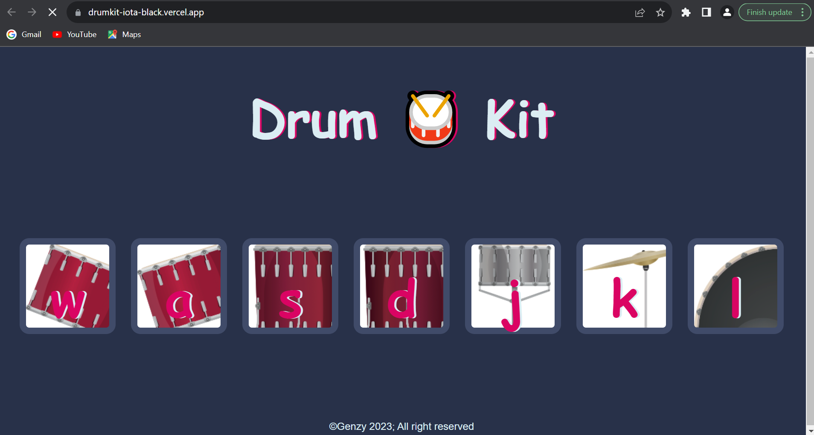

# Drumkit
# Drum Kit Readme



This is a simple and interactive drum kit created using HTML, CSS, and JavaScript. With this drum kit, you can play various drum sounds using your keyboard. It's a fun project that combines front-end technologies to create an engaging user experience.

## Table of Contents

1. [Demo](#demo)
2. [Features](#features)
3. [Usage](#usage)
4. [Contributing](#contributing)

## Demo

You can check out the live demo of the Drum Kit here: [Drum Kit Demo](https://drumkit-iota-black.vercel.app/)

## Features

- **Interactive Drum Kit**: Play drum sounds by pressing keyboard keys associated with different drum instruments.
- **Realistic Sounds**: The kit uses high-quality audio samples to mimic the sound of real drums.
- **Responsive Design**: The interface adapts to various screen sizes and devices, making it accessible on both desktop and mobile.

## Usage

1. Clone the repository to your local machine:

   ```
   git clone https://github.com/yourusername/drum-kit.git
   ```

2. Open the project folder in your code editor.

3. Open the `index.html` file in your web browser to start using the drum kit.

4. To play the drums, simply press the following keys on your keyboard:
   - W: Tom
   - A: Floor Tom
   - S: Hi-Hat
   - D: Bass Drum
   - j: Snare Drum 
   - K: Crash 
   - I: kick bass 

5. You can also click on the drum images to produce the corresponding sounds.

## Contributing

If you want to contribute to this project, follow these steps:

1. Fork the repository to your GitHub account.

2. Clone the forked repository to your local machine:

   ```
   git clone https://github.com/yourusername/drum-kit.git
   ```

3. Create a new branch for your changes:

   ```
   git checkout -b feature/your-feature
   ```

4. Make your changes and commit them with descriptive commit messages.

5. Push your changes to your fork on GitHub:

   ```
   git push origin feature/your-feature
   ```

6. Create a pull request on the original repository to propose your changes.

